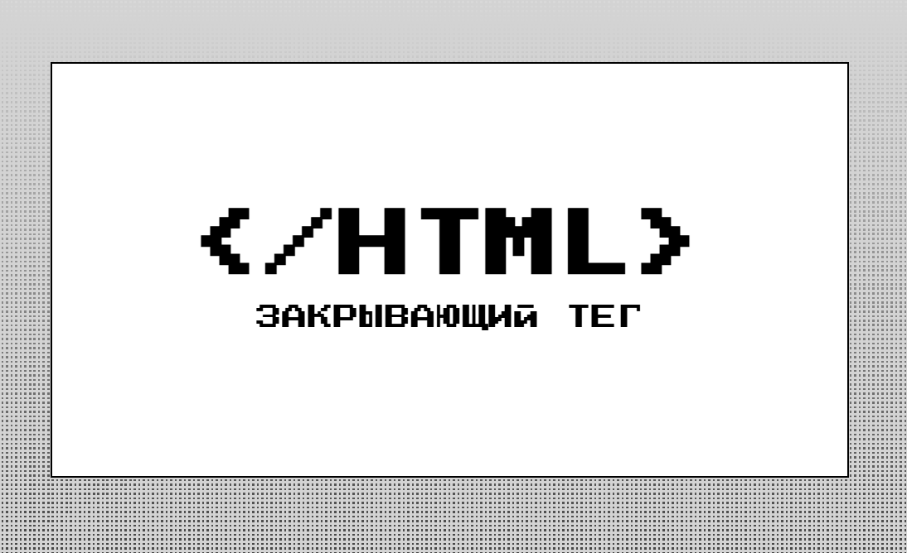
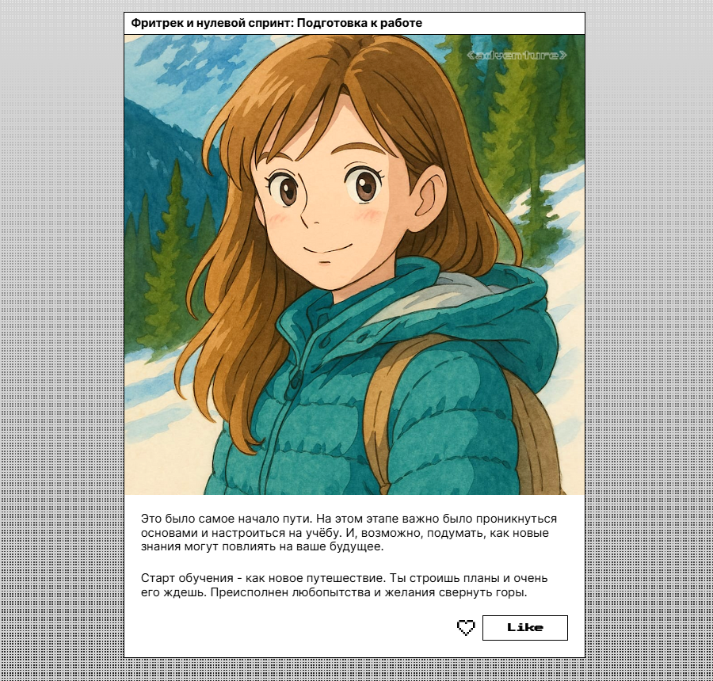
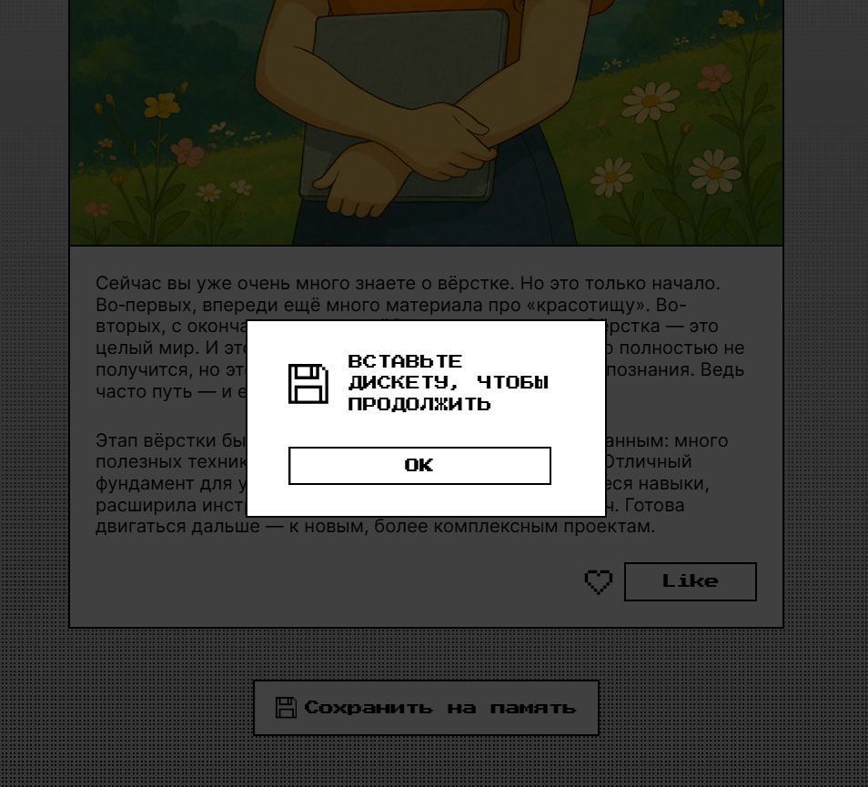

# Проект Закрывающий тег 🗻🧘

[Ссылка на проект в GitHub](https://github.com/HelenVirtanen/zakrivayuschiy-teg-f)

[Посмотреть на GitHub Pages](https://helenvirtanen.github.io/zakrivayuschiy-teg-f/)

## 📖 Описание проекта: 
"Закрывающий тег" — это лендинг в формате блога, в котором собраны посты с рефлексией на тему изучения вёрстки.
Каждый пост сопровождается атмосферной картинкой в духе студии Ghibli, а интерфейс оформлен в ретро-стиле: кнопки, иконки и фон.

### 💡 __Основная идея__ — рассказать о мыслях и впечатлениях в период обучения верстке.

### 🧩 Элементы интерфейса:
* __Интро-блок с заголовком__;
* __Список постов__ с изображением, описанием и двумя кнопками лайка на каждом;
* __Кнопка "Сохранить на память"__, по нажатию которой открывается модальное окно с имитацией сохранения на дискету (<dialog>);
*__Анимация__ сердечка при лайке для повышения интерактивности.


### ⚙️ Что делает скрипт:
* позволяет ставить и снимать лайк у поста;
* добавляет анимацию сердечка при клике;
* меняет текст кнопки в зависимости от состояния лайка.

## 🖼️ Скриншоты
### 🧢 Хедер


### 📄 Карточка с постом 


### 📌 Модальное окно


## 🛠️ Применяемые технологии
* HTML
* CSS (включая резиновую и адаптивную верстку)
* JavaScript

## 🚀 Установка и запуск
**1. Клонировать репозиторий**
```bash
git clone https://github.com/HelenVirtanen/zakrivayuschiy-teg-f
```

**2. Запустить**
* Открыть проект в VS Code.
* Убедиться, что установлен плагин Live Server.
* Нажать "Go Live" в правом нижнем углу редактора.

## 🔮 Планируемые дополнения
Добавление переключателя тем: светлая / тёмная / авто.